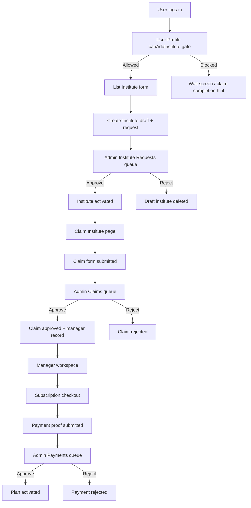

# AcademyFind Institute Flow Performa

This document traces the current institute lifecycle in the codebase from the first listing submission through claim ownership and subscription payment approval. It is written from the implementation, not as a product proposal.

## 1. Main Actors

- User: creates an institute listing, then claims it as the owner or representative.
- Admin: approves or rejects the listing request, claim request, and payment proof.
- Manager: the user becomes a manager only after claim approval or if the system assigns manager access through the request approval path.

## 2. End-to-End Flow

## 3. Listing Creation Flow

### Entry gate

- The profile page checks `session` and then loads the DB user.
- The "List Your Academy" card only appears when `dbUser.canAddInstitute === true`.
- If the flag is false, the user is blocked from the create flow and sees a waiting screen in `/user/create-institute`.

### What the create form collects

- Institute name
- Description
- Phone
- Email
- Website URL
- Google Maps URL
- City
- Fee info
- Address
- Latitude and longitude
- Categories
- Optional cover image

### Server-side actions on submit

The `addInstitute` action does the following:

- Generates a slug from the institute name.
- Ensures the slug is unique by appending `-1`, `-2`, and so on.
- Uploads the optional cover image to Cloudinary.
- Creates the `Institute` record with:
  - `isActive: false`
  - `subscriptionPlan: BASIC`
  - `imageUrl` if available
- Creates related `InstituteCategory` rows.
- Creates an `AdminNotification` of type `NEW_INSTITUTE_REQUEST`.
- Creates an `InstituteRequest` with status `PENDING`.
- Sets `user.canAddInstitute = false`.

### Immediate user outcome

- On success, the user is redirected to `/user/create-institute/[id]/claim`.
- The code currently treats this as the next step in the same lifecycle.

## 4. Admin Institute Approval Flow

### Where admins review it

- Admin dashboard shows pending institute request counts.
- `/af-ass-manage/instituteRequests` lists pending, approved, and rejected requests.
- Each request card includes the submitted institute data, category chips, city, fee, and the attached pending claim if one exists.

### Approve action

`approveInstituteRequest(requestId)`:

- Loads the request and the institute with pending claims.
- Activates the institute by setting `isActive: true` and `isPublished: true`.
- Deletes the request row.
- If there is a pending claim, it also:
  - Marks that claim as `APPROVED`.
  - Creates an `InstituteManager` row for the claimer.

### Reject action

`rejectInstituteRequest(requestId)`:

- Loads the request.
- Deletes the institute.
- Deletes the request.
- Leaves no publishable institute behind.

### Practical meaning

- A listing can be approved even before ownership is claimed.
- If a pending claim exists at approval time, the claimant gets manager access in the same transaction.
- If no claim exists, the institute becomes public but no manager record is created from this path.

## 5. Claim Ownership Flow

### Claim entry point

- The claim page lives at `/user/create-institute/[id]/claim`.
- It requires a logged-in session.
- If the institute ID is invalid, the page returns `notFound()`.

### Claim form data

- Full name
- Phone number
- Email
- Role at institute
- Optional extra message

### Server-side claim submission

`submitClaimRequest(formData)`:

- Validates required fields.
- Checks for an existing claim with the same `userId`, `instituteId`, and `status: PENDING`.
- Rejects the submission if a pending duplicate exists.
- Creates a new `InstituteClaim` with `status: PENDING`.
- Revalidates the public institute page.

### Admin claim review

- `/af-ass-manage/claims` lists claims with filters for All, Pending, Approved, and Rejected.
- Each claim row shows institute details, claimer info, role, message, status, and action buttons.
- Admin can approve or reject the claim.

### Claim approval side effects

`updateClaimStatus(claimId, "APPROVED")`:

- Updates the claim status to `APPROVED`.
- Updates the user role to `INSTITUTE_MANAGER`.
- Upserts an `InstituteManager` mapping for that user and institute.

### Claim rejection side effects

`updateClaimStatus(claimId, "REJECTED")`:

- Only updates the claim status to `REJECTED`.
- Does not delete the institute, request, or manager record.

## 6. Subscription Payment Flow

### Where it starts

- After the user becomes a manager, the manager dashboard exposes the subscription path.
- The subscription page loads the institute and passes the current plan to the checkout client.

### Checkout steps

The checkout form:

- Lets the manager switch between monthly and annual billing.
- Shows the start date and expiry date.
- Supports a coupon code, currently `NOIDA10`.
- Collects:
  - planRequested
  - billingCycle
  - amountPaid
  - UTR / transaction ID
  - optional proof image

### Payment submission logic

`submitPaymentProof(instituteId, formData)`:

- Requires a UTR number of at least 6 characters.
- Rejects the submission if the UTR already exists.
- Uploads the proof image to Cloudinary if provided.
- Creates a `SubscriptionPayment` row with `status: PENDING`.
- Revalidates the manager subscription page.

### Admin payment review

- `/af-ass-manage/payments` lists payment requests.
- `/af-ass-manage/payments/[id]` shows full proof, UTR, plan, and the linked institute.
- Admin can approve or reject from the detail screen.

### Payment approval side effects

`approvePayment(paymentId)`:

- Only continues if the payment exists and is still pending.
- Calculates the expiry date from the billing cycle:
  - Monthly adds about 30 days.
  - Annual adds 1 year.
- Marks the payment `APPROVED`.
- Updates the institute subscription plan to the requested plan.
- Stores the new expiry date on the institute.

### Payment rejection side effects

`rejectPayment(paymentId)`:

- Marks the payment `REJECTED`.
- Does not change the institute plan.

## 7. Status Model Observed in Code

- InstituteRequest: `PENDING`, `APPROVED`, `REJECTED`
- InstituteClaim: `PENDING`, `APPROVED`, `REJECTED`
- SubscriptionPayment: `PENDING`, `APPROVED`, `REJECTED`
- User role after claim approval: `INSTITUTE_MANAGER`

## 8. Important Edge Cases And Gaps

- The create-institute gate depends on `user.canAddInstitute`, but the institute request approval code does not set that flag back to true. If the UX expects the same user to create another institute later, there must be a separate admin toggle or manual update.
- `submitClaimRequest` blocks only duplicate pending claims. Rejected claims do not block a new claim, but the create-institute wait screen checks only whether any claim exists, not whether it was rejected.
- `approveInstituteRequest` only uses the first pending claim it finds for the institute. If multiple pending claims exist, only one claimant is promoted in that path.
- `updateClaimStatus` does not verify the claim’s current status before changing it. The UI hides the buttons for processed rows, but the server action itself is not status-guarded.
- `approvePayment` returns "Payment not found" both when the payment is missing and when it exists but is not pending. That is misleading for operators.
- `approvePayment` revalidates `/af-ass-manage/payment/[id]`, but the actual route is `/af-ass-manage/payments/[id]`. The plural/singular mismatch means one cache target is wrong.
- The payment detail page links back to `/af-ass-manage/payments ` with a trailing space, which can break navigation.
- `InstituteClaim.status` is a plain string, not an enum, so invalid statuses are possible if data is written outside these actions.
- `InstituteRequest.instituteId` is unique, so the system supports only one request row per institute at a time.
- `SubscriptionPayment.utrNumber` is unique, which is the main duplicate-payment guard in the current flow.

## 9. What The Flow Means Operationally

- Listing creation is a gated draft submission process, not immediate publishing.
- Claiming is a separate ownership assertion that can happen before or after request approval.
- Admin approval of the listing and admin approval of the claim are partially independent workflows.
- Subscription billing is a third step that begins only after the manager workspace is available.
- The code is designed around admin verification at each stage, with transactions used to keep DB updates atomic on approval paths.

## 10. Short Version

1. User gets `canAddInstitute` permission.
2. User submits institute listing.
3. System creates draft institute + pending institute request and blocks further listing creation.
4. User submits claim details for the same institute.
5. Admin approves or rejects the listing request.
6. If a pending claim exists during approval, the user is also promoted to institute manager.
7. Manager opens subscription checkout and submits payment proof.
8. Admin approves or rejects the payment.
9. On payment approval, the institute plan and expiry date are updated.
